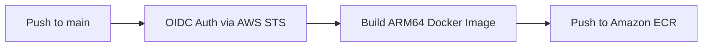

# Task & Metrics API — Application Service

A high-performance RESTful API built with **Python (FastAPI)** for task management and usage tracking. Designed to run natively on **Kubernetes (AWS EKS)** powered by **ARM64 (AWS Graviton)** architecture and backed by **Amazon ElastiCache Redis** for fast data persistence and atomic counters.

> ℹ️ **Infrastructure & Deployment:** The Terraform manifests, VPC topology, EKS cluster configuration, and Helm charts for this service are managed in the [AWS EKS Infrastructure Repository](https://github.com/AVC-09/aws-iac-eks).

---

## 🚀 Key Features

- **FastAPI Framework:** Asynchronous, low-latency endpoints with auto-generated OpenAPI documentation (`/docs`).
- **Caching & Persistence:** Integrated with ElastiCache Redis for read optimization and real-time metrics aggregation.
- **Multi-Arch Container (ARM64 / Graviton):** Optimized to run on cost-effective AWS Graviton nodes (`m7g`/`c7g`) using a lightweight Python Slim base image.
- **Health Checks & Observability:** Dedicated Liveness and Readiness probes tailored for Kubernetes cluster integration.
- **Automated CI/CD:** GitHub Actions pipeline utilizing **OIDC / IRSA** passwordless authentication to build and push images directly to **Amazon ECR**.

---

## 🛠️ Tech Stack

* **Language:** Python 3.11+
* **Framework:** FastAPI / Uvicorn
* **Caching:** Redis Client (`redis-py` / `aioredis`)
* **Containerization:** Docker (`linux/arm64`)
* **CI/CD:** GitHub Actions (OIDC Federated Auth)

---

## 📂 Repository Directory Structure

```text
```text
task-metrics-api/
├── .github/
│   └── workflows/
│       └── ci-cd.yml         # CI/CD Pipeline (OIDC Auth -> Build ARM64 -> Push ECR)
├── helm/
│   └── task-metrics-app/    # Helm chart configuration
│       ├── templates/        # K8s manifest templates for Helm
│       ├── Chart.yaml        # Helm chart metadata
│       └── values.yaml       # Helm default values configuration
├── k8s/                      # Raw Kubernetes manifests & local dev setup
│   ├── api.yaml              # App Deployment & Service manifests
│   ├── kind-config.yaml      # KinD cluster configuration for local testing
│   └── redis.yaml            # Redis Deployment & Service manifests
├── .gitignore
├── docker-compose.yml        # Local multi-container environment (API + Redis)
├── Dockerfile                # Multi-stage container build
├── main.py                   # FastAPI entrypoint application
├── README.md
└── requirements.txt          # Python dependencies
```

## 🔌 API Endpoints

| Method | Route | Description | Kubernetes Probe |
| :--- | :--- | :--- | :--- |
| `GET` | `/healthz` | **Liveness & Readiness Probe:** Validates API health and verifies active connection to Redis using `PING`. | `livenessProbe` / `readinessProbe` |
| `GET` | `/` | **Root Endpoint:** Serves a welcome message and tracks aggregate visits using an atomic Redis counter (`total_visits`). | - |
| `POST` | `/tasks/` | Creates a new task in Redis using a Hash key (`task:{id}`) and auto-incrementing ID. Validates non-blank titles. | - |
| `GET` | `/tasks/` | Retrieves a list of all existing Task IDs using a non-blocking `SCAN` iteration (`scan_iter`). | - |
| `GET` | `/tasks/{task_id}` | Fetches a specific task's details (`title` and `description`) by its ID from Redis. Returns `404` if not found. | - |

---

## ⚙️ Environment Variables

The application is dynamically configured via the following environment variables:

| Variable | Description | Default Value |
| :--- | :--- | :--- |
| `REDIS_HOST` | Endpoint / hostname for the Redis database or ElastiCache cluster. | `localhost` |
| `REDIS_PORT` | Port for the Redis service. | `6379` |
| `REDIS_SSL` | Enables SSL/TLS connection to Redis (useful for ElastiCache with in-transit encryption). Accepts `true` or `false`. | `false` |

---

## 💻 Local Development Setup

### Prerequisites
- Python 3.11+
- Docker & Docker Compose
- A local Redis instance (or running container)

### 1. Clone the repository
```bash
git clone https://github.com/AVC-09/task-metrics-api.git
cd task-metrics-api
```

### 2. Create a virtual environment and install dependencies
```bash
python3 -m venv venv
source venv/bin/activate
pip install -r requirements.txt
```

### 3. Run Redis locally with Docker
```bash
docker run -d --name local-redis -p 6379:6379 redis:alpine
```
### 4. Start the application
```bash
export REDIS_HOST="localhost"
export REDIS_PORT="6379"
uvicorn app.main:app --reload --port 8000
```
Access the interactive OpenAPI documentation at: http://localhost:8000/docs

## 🐳 Building the Docker Image

To build the image locally targeting the ARM64 architecture (matching AWS Graviton nodes):

```bash
docker buildx build --platform linux/arm64 -t task-metrics-api:latest .
```

## 🔄 CI/CD Pipeline (GitHub Actions)

The workflow defined in `.github/workflows/deploy.yml` runs automatically on every `push` to the `main` branch:



1. **Passwordless Authentication (OIDC):** Assumes an IAM Role in AWS via OpenID Connect without storing long-lived `AWS_ACCESS_KEY_ID` secrets.
2. **Build & Push:** Compiles the native `linux/arm64` container image using `docker buildx` and pushes it to **Amazon ECR** tagged with the commit SHA.

---

## 🔮 Next Steps & Future Enhancements

The current implementation focuses on core functionality, infrastructure alignment, and container deployment. Planned roadmap improvements include:

- [ ] **Automated Testing Suite (Pytest):** Implement unit and integration tests under a `tests/` module, integrating a testing stage into the GitHub Actions pipeline before building images.
- [ ] **Explicit Graceful Shutdown:** Add a custom FastAPI `lifespan` context manager in `app/main.py` to explicitly intercept `SIGTERM` signals and close active Redis connections gracefully prior to Pod termination.
- [ ] **Structured Logging & Tracing:** Integrate `structlog` and OpenTelemetry middleware to export APM traces to AWS X-Ray or Datadog.