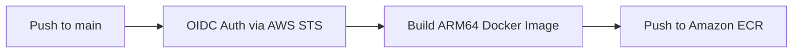

# Task & Metrics API — Application Service

A high-performance RESTful API built with **Python (FastAPI)** for task management and real-time performance metrics tracking. Designed to run natively on **Kubernetes (AWS EKS)** powered by **ARM64 (AWS Graviton)** architecture and backed by **Amazon ElastiCache Redis** for caching.

---

## 🚀 Key Features

- **FastAPI Framework:** Asynchronous, low-latency endpoints with auto-generated OpenAPI documentation (`/docs`).
- **Caching & Persistence:** Integrated with ElastiCache Redis for read optimization and real-time metrics aggregation.
- **Multi-Arch Container (ARM64 / Graviton):** Optimized to run on cost-effective AWS Graviton nodes (`m7g`/`c7g`) using a lightweight Python Slim base image.
- **Health Checks & Observability:** Dedicated Liveness and Readiness probes tailored for Kubernetes cluster integration.
- **Automated CI/CD:** GitHub Actions pipeline utilizing **OIDC / IRSA** passwordless authentication to build and push images directly to **Amazon ECR**.

---

## 🛠️ Tech Stack

* **Language:** Python 3.11+
* **Framework:** FastAPI / Uvicorn
* **Caching:** Redis Client (`redis-py` / `aioredis`)
* **Containerization:** Docker (`linux/arm64`)
* **CI/CD:** GitHub Actions (OIDC Federated Auth)

---

## 📂 Repository Directory Structure

```text
task-metrics-api/
├── app/
│   ├── api/                # API v1 routes and endpoints
│   ├── core/               # Global application settings and environment vars
│   ├── db/                 # ElastiCache Redis connection and client setup
│   ├── models/             # Data schemas (Pydantic models)
│   ├── services/           # Business logic
│   └── main.py             # FastAPI entrypoint
├── .github/
│   └── workflows/
│       └── deploy.yml      # CI/CD Pipeline (OIDC Auth -> Build ARM64 -> Push ECR)
├── Dockerfile              # Optimized multi-stage build
├── requirements.txt        # Application dependencies
└── README.md
```

## 🔌 API Endpoints

| Method | Route | Description | Kubernetes Probe |
| :--- | :--- | :--- | :--- |
| `GET` | `/healthz` | **Liveness Probe:** Verifies the process is alive. | `livenessProbe` |
| `GET` | `/ready` | **Readiness Probe:** Verifies active connectivity to Redis. | `readinessProbe` |
| `GET` | `/api/v1/tasks` | Lists tasks (retrieves from Redis cache if available). | - |
| `POST` | `/api/v1/tasks` | Creates a new task and invalidates/updates cache. | - |
| `GET` | `/api/v1/metrics` | Retrieves aggregated system metrics. | - |

---

## ⚙️️ Environment Variables

The application is dynamically configured via the following environment variables:

| Variable | Description | Default Value |
| :--- | :--- | :--- |
| `APP_ENV` | Execution environment (`development`, `production`). | `production` |
| `PORT` | Internal port Uvicorn listens on. | `8000` |
| `REDIS_HOST` | Endpoint for the ElastiCache Redis cluster. | `localhost` |
| `REDIS_PORT` | Port for the Redis cluster. | `6379` |
| `LOG_LEVEL` | Logging verbosity (`debug`, `info`, `warning`). | `info` |

---

## 💻 Local Development Setup

### Prerequisites
- Python 3.11+
- Docker & Docker Compose
- A local Redis instance (or running container)

### 1. Clone the repository
```bash
git clone [https://github.com/your-username/task-metrics-api.git](https://github.com/your-username/task-metrics-api.git)
cd task-metrics-api
```

### 2. Create a virtual environment and install dependencies
```bash
python3 -m venv venv
source venv/bin/activate
pip install -r requirements.txt
```

3. Run Redis locally with Docker
```bash
docker run -d --name local-redis -p 6379:6379 redis:alpine
```
4. Start the application
```bash
export REDIS_HOST="localhost"
export REDIS_PORT="6379"
uvicorn app.main:app --reload --port 8000
```
Access the interactive OpenAPI documentation at: http://localhost:8000/docs

## 🐳 Building the Docker Image

To build the image locally targeting the ARM64 architecture (matching AWS Graviton nodes):

```bash
docker buildx build --platform linux/arm64 -t task-metrics-api:latest .
```

## 🔄 CI/CD Pipeline (GitHub Actions)

The workflow defined in `.github/workflows/deploy.yml` runs automatically on every `push` to the `main` branch:



1. **Passwordless Authentication (OIDC):** Assumes an IAM Role in AWS via OpenID Connect without storing long-lived `AWS_ACCESS_KEY_ID` secrets.
2. **Build & Push:** Compiles the native `linux/arm64` container image using `docker buildx` and pushes it to **Amazon ECR** tagged with the commit SHA.

---

## 🔮 Next Steps & Future Enhancements

The current implementation focuses on core functionality, infrastructure alignment, and container deployment. Planned roadmap improvements include:

- [ ] **Automated Testing Suite (Pytest):** Implement unit and integration tests under a `tests/` module, integrating a testing stage into the GitHub Actions pipeline before building images.
- [ ] **Explicit Graceful Shutdown:** Add a custom FastAPI `lifespan` context manager in `app/main.py` to explicitly intercept `SIGTERM` signals and close active Redis connections gracefully prior to Pod termination.
- [ ] **Structured Logging & Tracing:** Integrate `structlog` and OpenTelemetry middleware to export APM traces to AWS X-Ray or Datadog.